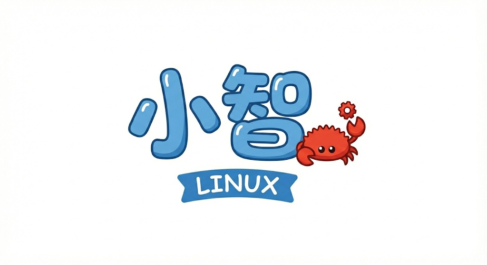
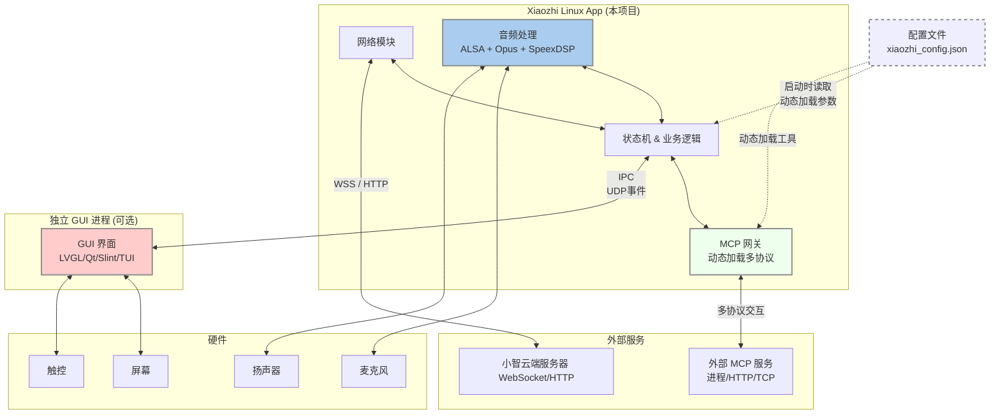

# Xiaozhi Linux



[English](./README_en.md) | 简体中文 

---


## 项目简介

本项目是小智 AI 客户端在 Linux 平台的完整实现，集成了**网络交互、音频处理、业务逻辑控制**。通过统一的 Rust 应用整合了音频、GUI 交互和云端通信，提供了现代化、高效的 AI 客户端方案。

>**GUI 设计**：由于 Rust 暂缺成熟且开源友好的嵌入式 GUI 库，本项目**不集成 GUI 功能**，而是通过进程间通信与独立的 GUI 进程交互。这种解耦设计可根据具体设备需求灵活选择 LVGL、Qt、Slint、TUI 等图形库，不用 GUI 进程也不影响本项目的完整功能。


***为什么选择 Rust？***

并不是为了蹭 “**Rewrite It In Rust**” 的热度，而是是个人兴趣和练手。同时，Rust 的现代包管理、交叉编译友好性和类型安全特性，为嵌入式 Linux 设备提供了相对统一的开发体验，有助于忽略不同 SDK、工具链和内核差异带来的生态割裂，提升项目可维护性。

本项目建立在[虾哥 esp32 版小智](https://github.com/78/xiaozhi-esp32)和[百问网 Linux 版小智](https://github.com/100askTeam/xiaozhi-linux)的优良设计和宝贵经验之上，向他们致敬。

QQ群：695113129

---


## 系统架构



## ✨ 功能

### 已实现的功能

- ✓ **音频处理**
  - 支持 I2S 声卡和 USB 声卡
  - ALSA 实时音频采集与播放
  - Opus 音频编码（16kHz、PCM16）与解码
  - SpeexDSP 实时处理（降噪、AGC、重采样）
  - 支持自定义音频设备配置，参考[音频设备配置说明](./docs/音频设备配置说明.md)

- ✓ **云端交互与协议**
  - WebSocket 全双工长连接与心跳保活
  - 设备鉴权认证与 Hello 握手
  - TTS（文本转语音）、STT（语音转文字）、IoT 控制指令

- ✓ **设备管理**
  - 自动设备激活与绑定
  - 设备身份持久化（Client ID、Device ID）
  - 状态机管理（空闲、聆听、处理、说话、网络错误）

- ✓ **配置系统**
  - TOML 文件配置加载
  - 运行时参数持久化
  - 环境变量覆盖

- ✓ **MCP 扩展能力**
  - 解耦的 MCP 网关设计，支持外部工具动态集成
  - 标准 JSON-RPC 消息处理与工具生命周期管理
  - 通过 stdin/stdout 与外部脚本通信
  - 支持动态工具配置，修改后无需重新编译，参考[MCP 功能说明](./docs/MCP功能说明.md)

### 待实现的功能


- ☐ **IoT 与智能家居联动**

- ☐ **本地离线唤醒与音频前端处理（AFE）**


---


> 注：ESP32 环境中，小智通常作为唯一的固件程序，需要大包大揽地管理从底层 Wi-Fi 驱动、配网协议（BluFi/AP）、系统自更新（OTA）到开机自启动的所有逻辑。而在 Linux 系统中，小智是以一个独立系统进程的形式存在的。因此，许多在嵌入式端必须内置的功能，如配网、硬件驱动、启动管理等，在 Linux 版中被移交给了操作系统更专业的组件。同样的，OTA 功能也不会内置于本项目，而是由其他项目进行实现，具体见[ OTA 说明](./docs/OTA功能说明.md)。

## 快速开始 

### 依赖环境

- **Rust Toolchain** (Stable 1.75+)

- **Linux 开发环境** 

- **C 开发工具链** (gcc, make, pkg-config)

- **嵌入式 Linux 设备的 SDK，或者制作 sysroot**（用于动态链接 libc 和 音频相关 c 库）

- **动态库**：

  - `libasound2-dev` / `alsa-lib-devel` (ALSA 音频库)
  - `libopus-dev` / `opus-devel` (Opus 编解码库)  
  - `libspeexdsp-dev` / `speexdsp-devel` (SpeexDSP 处理库)


### 已验证的目标设备（开发板）

> 运行该项目，需要目标设备有音频输入和输出功能

- **armv7-unknow-linux-uclibceabihf**
  - [Luckfox pico 系列](https://wiki.luckfox.com/zh/Luckfox-Pico-RV1106/)（Rockchip RV1106）
  - [Echo-Mate 桌面机器人](https://github.com/No-Chicken/Echo-Mate) （Rockchip RV1106）
- **armv7-unknow-linux-gnueabihf**
  - [Luckfox Lyra 系列](https://wiki.luckfox.com/zh/Luckfox-Lyra/Introduction) （Rockchip RK3506）
- **aarch64-unknown-linux-gnu**
  - [Dshanpi-A1](https://wiki.dshanpi.org/docs/DshanPi-A1/intro/) (Rockchip RK3576)
- **x86_64-unknown-linux-gnu**
  - 安装了Arch Linux 的笔记本电脑

其他目标平台的 Linux 设备（包括x86虚拟机）暂未进行验证，理论上都支持，具体交叉编译流程参考 [Rust Book](https://doc.rust-lang.org/beta/rustc/platform-support.html) 和 [RV1106 的编译脚本](./boards/rv1106_uclibceabihf/armv7_uclibc_build.sh)。

支持基于 musl 的完全静态链接，可从release中下载编译好的二进制，具体编译步骤参考 scripts 中的脚本。

**欢迎进行测试和提交 Pull Request**（scripts 中的编译脚本和 README 的当前部分）

---


### 本地编译与运行

```bash
# 克隆项目
git clone https://github.com/Hyrsoft/xiaozhi_linux_rs.git
cd xiaozhi_linux_rs

# 安装依赖（Ubuntu/Debian）
sudo apt-get install -y \
    libasound2-dev \
    libopus-dev \
    libspeexdsp-dev \
    pkg-config

# 编译
cargo build --release

# 运行（需要网络连接和配置文件）
cargo run --release
```

### 交叉编译到嵌入式设备

#### 以编译到 Luckfox Pico (RV1106) 为例

```bash
# 不需要准备 sdk 环境，直接使用交叉编译脚本即可，它会自动下载交叉编译工具链和依赖库，并进行编译和链接

# 添加对应目标支持
rustup target add armv7-unknown-linux-uclibceabihf
rustup toolchain install nightly
rustup component add rust-src --toolchain nightly

# 使用提供的编译脚本
./scripts/armv7-unknown-linux-uclibceabihf/build.sh

# 编译输出：target/armv7-unknown-linux-uclibceabihf/release/xiaozhi_linux_rs
```

#### 验证编译结果

```bash
[root@luckfox root]# ldd xiaozhi_linux_rs 
        libasound.so.2 => /usr/lib/libasound.so.2 (0xa6d72000)
        libgcc_s.so.1 => /lib/libgcc_s.so.1 (0xa6d43000)
        libc.so.0 => /lib/libc.so.0 (0xa6cb4000)
        ld-uClibc.so.1 => /lib/ld-uClibc.so.0 (0xa6efc000)
```

---

## 开源协议与分发说明

本项目核心代码采用 MIT 协议开源。项目依赖的音频组件（ALSA 相关库）基于 LGPL 协议。

鉴于开源协议限制，本项目分发的静态链接二进制文件仅建议用于测试与评估。若您计划对本项目进行二次开发或商业分发，请务必遵循 LGPL 协议规范（例如：采用动态链接方式，或开源您的衍生作品）。开发者需自行承担因违反开源协议而产生的法律风险，本项目不承担任何连带责任。

---


## 贡献

如果你对嵌入式 Rust、Linux 网络编程感兴趣，欢迎提交 Issue 或 Pull Request！

---


## 致谢

- [78/xiaozhi-esp32](https://github.com/78/xiaozhi-esp32)
- [100askTeam/xiaozhi-linux](https://github.com/100askTeam/xiaozhi-linux)
- [xinnan-tech/xiaozhi-esp32-server](https://github.com/xinnan-tech/xiaozhi-esp32-server)