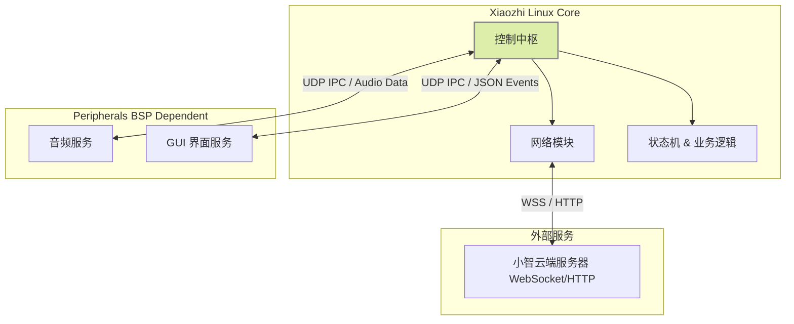

# Xiaozhi Linux Core 

## 项目简介 

本项目专注于小智 AI 客户端整个系统的**网络交互**与**业务逻辑控制**部分。通过 IPC协议与音频服务和 GUI 服务交互，实现业务逻辑与硬件 BSP 的解耦。


## 系统架构

通过多进程解耦设计，将系统划分为不同的职责域。



- **xiaozhi_linux_core :** 负责与云端通信、设备状态管理、OTA 激活逻辑以及指令分发。
- **Audio Service:** 负责底层的 ALSA/PulseAudio 录音与播放（本项目不包含，通过 UDP 交互）。
- **GUI Service:** 负责屏幕显示与触控交互（本项目不包含，通过 UDP 交互）。

## ✨ 目前实现的功能 

- **云端交互与鉴权**
  - **全双工连接**：维护与小智服务器的 WebSocket 长连接，处理心跳保活与异常断线自动重连。
  - **协议握手**：处理设备鉴权、Hello 握手消息，建立合法的通信会话。
  - **云端指令分发**：解析来自云端的 TTS（语音合成）、STT（语音转写）、IoT 控制指令，并分发给对应的本地服务。

- **激活与生命周期管理**
  - **设备激活**：首次启动自动检测激活状态，支持获取并在 GUI 上显示 6 位验证码，完成设备绑定流程。
  - **状态流转**：维护核心业务状态机（空闲、聆听中、处理中、说话中、网络错误）。
  - **身份标识**：自动生成并持久化设备唯一的 Client ID 和 Device ID。

- **多进程协同 (IPC)**
  - **音频流透传**：充当音频中继站，通过 UDP 接收音频服务的 PCM 数据并转发至云端，同时将云端下发的音频流转发给播放服务。
  - **UI 交互控制**：通过异步 UDP 接口向 GUI 进程发送状态更新（如：显示“正在聆听”图标）或弹窗消息（如：Toast 提示、验证码）。
  - **IoT 指令桥接**：接收云端的智能家居控制指令，并通过 UDP 转发给 IoT 执行进程。

- **配置管理**
  - **动态配置加载**：支持从环境变量、配置文件 (`xiaozhi_config.json`) 或编译期默认值加载系统参数。
  - **配置持久化**：运行时生成的关键信息（如设备 ID）会自动回写保存，确保重启后状态不丢失。

## 为什么用Rust？

- **编译器兼容性**：考虑到嵌入式 Linux 设备的多样性，Rust 避免了对高版本 C++（如虾哥esp32小智的C++17）的依赖，能够更好地适配古早设备及不同的编译器环境。
- **包管理与构建**：相比 C++，Rust 拥有现代化的包管理工具。全静态链接特性极大简化了交叉编译流程，避免了处理第三方库依赖的繁琐。
- **异步模型**：项目基于异步 Rust 构建，提供了清晰易读的代码框架，显著提升了代码的可维护性和功能扩展性。


## 快速开始 

### 依赖环境

- Rust Toolchain (Stable)
- Linux 环境 (或 macOS/Windows + WSL)

### 编译与运行

**本地运行:**

```bash
# 克隆项目
git clone https://github.com/haoruanwn/xiaozhi_linux_core.git
cd xiaozhi_linux_core

# 运行 (需确保本地没有占用对应 UDP 端口)
cargo run
```

**交叉编译 (推荐用cross编译musl的版本):**

``` bash
# 安装目标架构支持
cargo install cross

# cross需要docker或者podman来运行
# 例如，编译为 armv7 musleabihf 目标 (静态链接)
cross build \
   --target=armv7-unknown-linux-musleabihf \
   --release \
   --config 'target.armv7-unknown-linux-musleabihf.rustflags=["-C", "target-feature=+crt-static"]'

# 或者使用对应架构的编译器
```

------

## 6. 配套仓库

本项目核心（Core）与硬件完全解耦。音频和 GUI 服务需根据具体硬件选择适配的仓库。以下仓库可作为参考模板：

| **仓库名称**      | **链接**                                                     | **说明**                     |
| ----------------- | ------------------------------------------------------------ | ---------------------------- |
| **Audio Service** | [xiaozhi_linux_audio](https://github.com/haoruanwn/xiaozhi_linux_audio) | 音频服务参考实现             |
| **GUI Service**   | [xiaozhi_linux_lvgl](https://github.com/haoruanwn/xiaozhi_linux_lvgl) | 基于 LVGL 的界面服务参考实现 |

------

## 贡献

如果你对嵌入式 Rust、Linux 网络编程感兴趣，欢迎提交 Issue 或 Pull Request！

## 致谢

- [78/xiaozhi-esp32](https://github.com/78/xiaozhi-esp32)
- [100askTeam/xiaozhi-linux](https://github.com/100askTeam/xiaozhi-linux)
- [xinnan-tech/xiaozhi-esp32-server](https://github.com/xinnan-tech/xiaozhi-esp32-server)

