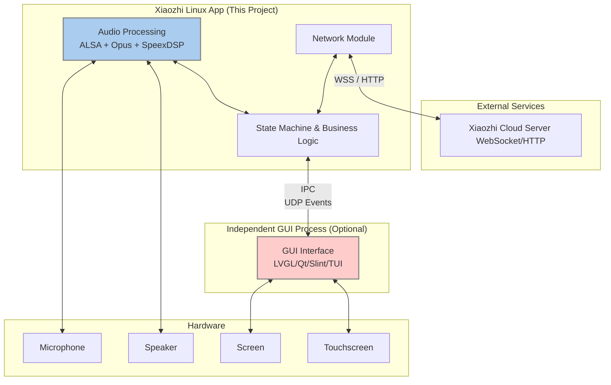

# Xiaozhi Linux


English | [简体中文](./README.md) 

---


## Project Introduction

This project is a complete implementation of the Xiaozhi AI client on the Linux platform, integrating **network interaction, audio processing, and business logic control**. Through a unified Rust application, it consolidates audio, GUI interaction, and cloud communication to provide a modern and efficient AI client solution.

> ***GUI Design***: Since Rust currently lacks mature and open-source-friendly embedded GUI libraries, this project **does not integrate GUI functionality**. Instead, it communicates with independent GUI processes through inter-process communication (IPC). This decoupled design allows flexible selection of graphics libraries such as LVGL, Qt, Slint, or TUI based on specific device requirements. The project functions completely even without a GUI process.

***Why Choose Rust?***

Not to ride the wave of "**Rewrite It In Rust**", but rather for personal interest and practice. Rust's modern package management, cross-compilation friendliness, and type safety characteristics provide a relatively unified development experience for embedded Linux devices. This helps overcome the ecosystem fragmentation caused by different SDKs, toolchains, and kernel differences, improving project maintainability.

This project builds upon the excellent design and valuable experience of [虾哥's Xiaozhi ESP32 version](https://github.com/78/xiaozhi-esp32) and [100askTeam's Xiaozhi Linux version](https://github.com/100askTeam/xiaozhi-linux). We pay tribute to their work.

QQ Group：695113129

---

## System Architecture



- **Network Module**: Maintains WebSocket long connection with Xiaozhi server, handles heartbeat keepalive and reconnection on disconnection
- **Audio Processing**: Integrates ALSA for input/output, Opus codec, SpeexDSP real-time processing (noise reduction, AGC, resampling)
- **Business Logic**: State machine management, device activation, command dispatch, OTA management

## ✨ Features

### Implemented Features

- ✓ **Audio Processing**
  - ALSA real-time audio capture and playback
  - Opus audio encoding (16kHz, PCM16) and decoding
  - SpeexDSP real-time processing (noise reduction, AGC, resampling)
  - Support for custom audio device configuration, see [Audio Device Configuration Guide](./docs/音频设备配置说明.md)

- ✓ **Cloud Interaction and Protocol**
  - WebSocket full-duplex long connection with heartbeat keepalive
  - Device authentication and Hello handshake
  - TTS (Text-to-Speech), STT (Speech-to-Text), IoT control commands

- ✓ **Device Management**
  - Automatic device activation and binding
  - Device identity persistence (Client ID, Device ID)
  - State machine management (Idle, Listening, Processing, Speaking, Network Error)

- ✓ **Configuration System**
  - TOML file configuration loading
  - Runtime parameter persistence
  - Environment variable override

### Features To Be Implemented


- ☐ **IoT and Smart Home Integration**

- ☐ **Local Offline Wake-up and Audio Front-end Processing (AFE)**

- ☐ **MCP Extension Capabilities**


---


> Note: In the ESP32 environment, Xiaozhi typically serves as the sole firmware program and must comprehensively manage all logic from low-level Wi-Fi drivers, provisioning protocols (BluFi/AP), and system self-updates (OTA) to auto-startup on boot. In Linux systems, however, Xiaozhi exists as an independent system process. Therefore, many features that must be built into the embedded version, such as provisioning, hardware drivers, and startup management, are delegated to more specialized components of the operating system in the Linux version. Similarly, OTA functionality will not be built into this project but will be implemented by other projects. See [OTA Documentation](./docs/OTA功能说明.md) for details.

## Quick Start

### Dependencies

- **Rust Toolchain** (Stable 1.75+)

- **Linux Development Environment**

- **C Development Toolchain** (gcc, make, pkg-config)

- **Embedded Linux Device SDK, or custom sysroot** (for dynamic linking libc and audio-related C libraries)

- **Dynamic Libraries**:

  - `libasound2-dev` / `alsa-lib-devel` (ALSA audio library)
  - `libopus-dev` / `opus-devel` (Opus codec library)
  - `libspeexdsp-dev` / `speexdsp-devel` (SpeexDSP processing library)

  This project relies on the above C binding libraries and **must use dynamic linking**. Static compilation (such as musl targets) is not supported.

### Verified Target Devices (Development Boards)

> Running this project requires the target device to have audio input and output capabilities.

- **armv7-unknow-linux-uclibceabihf**
  - [Luckfox Pico series](https://wiki.luckfox.com/en/Luckfox-Pico-RV1106/) (Rockchip RV1106)
  - [Echo-Mate Desktop Robot](https://github.com/No-Chicken/Echo-Mate) (Rockchip RV1106)
- **aarch64-unknown-linux-gnu**
  - [Dshanpi-A1](https://wiki.dshanpi.org/docs/DshanPi-A1/intro/) (Rockchip RK3576)
- **x86_64-unknown-linux-gnu**
  - Laptop with Arch Linux installed

Other Linux devices on different target platforms (including x86 virtual machines) have not been verified yet, but are theoretically supported. For specific cross-compilation procedures, refer to [Rust Book](https://doc.rust-lang.org/beta/rustc/platform-support.html) and [RV1106 build script](./boards/rv1106_uclibceabihf/armv7_uclibc_build.sh).

musl targets are not currently supported, as it's unclear how to statically link the required audio-related C libraries. This may be supported in the future.

**Testing and Pull Requests are welcome** (for build scripts in scripts and current sections of README).

---

### Local Build and Run

```bash
# Clone the repository
git clone https://github.com/Hyrsoft/xiaozhi_linux_rs.git
cd xiaozhi_linux_rs

# Install dependencies (Ubuntu/Debian)
sudo apt-get install -y \
    libasound2-dev \
    libopus-dev \
    libspeexdsp-dev \
    pkg-config

# Build
cargo build --release

# Run (requires network connection and configuration file)
cargo run --release
```

### Cross-compilation to Embedded Devices

#### Example: Compiling for Luckfox Pico (RV1106)

```bash
# Audio libraries need to be enabled in buildroot sdk

# Add support for the target
rustup target add armv7-unknown-linux-uclibceabihf
rustup toolchain install nightly
rustup component add rust-src --toolchain nightly

# Use the provided build script
./scripts/armv7-unknown-linux-uclibceabihf/build.sh

# Build output: target/armv7-unknown-linux-uclibceabihf/release/xiaozhi_linux_rs
```

#### Verify Build Results

```bash
[root@luckfox root]# ldd xiaozhi_linux_rs 
        libspeexdsp.so.1 => /usr/lib/libspeexdsp.so.1 (0xa6edc000)
        libopus.so.0 => /usr/lib/libopus.so.0 (0xa6e6b000)
        libasound.so.2 => /usr/lib/libasound.so.2 (0xa6d72000)
        libgcc_s.so.1 => /lib/libgcc_s.so.1 (0xa6d43000)
        libc.so.0 => /lib/libc.so.0 (0xa6cb4000)
        ld-uClibc.so.1 => /lib/ld-uClibc.so.0 (0xa6efc000)
```

---

## Contributing

If you're interested in embedded Rust and Linux network programming, we welcome you to submit Issues or Pull Requests!

---

## Acknowledgments

- [78/xiaozhi-esp32](https://github.com/78/xiaozhi-esp32)
- [100askTeam/xiaozhi-linux](https://github.com/100askTeam/xiaozhi-linux)
- [xinnan-tech/xiaozhi-esp32-server](https://github.com/xinnan-tech/xiaozhi-esp32-server)
